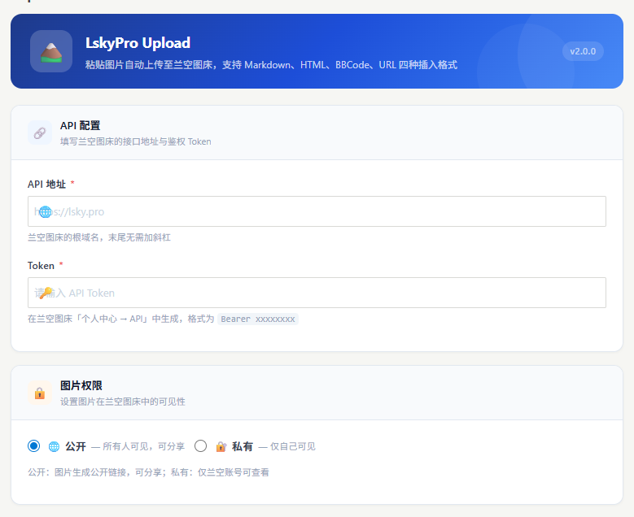
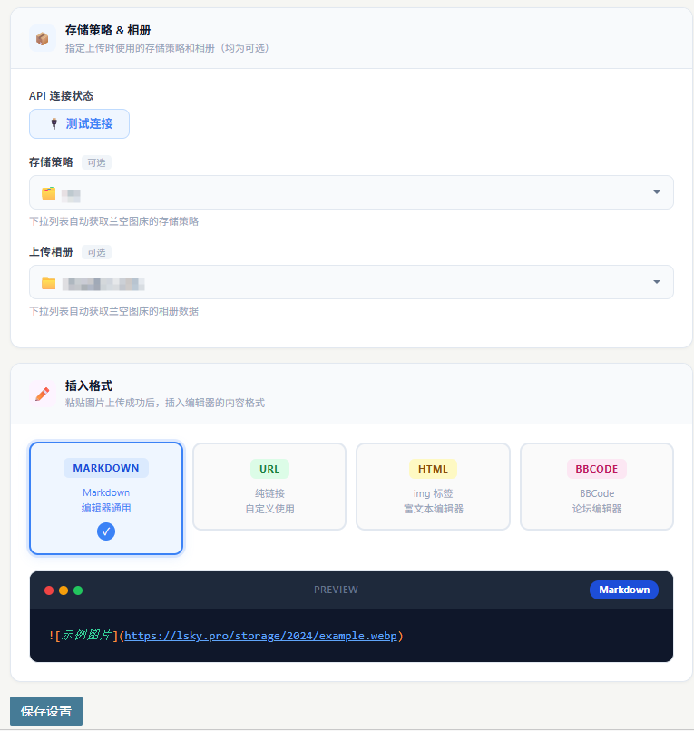

# LskyPro Upload Pro+

> Typecho 粘贴图片自动上传到兰空图床插件

## 📋 功能介绍

**LskyProUpload** 是一个 Typecho 插件，允许用户在文章/页面编辑器中**直接粘贴图片**，自动上传到兰空图床（Lsky Pro），并自动返回 Markdown 格式的图片链接。

**该版本是在 isYangs 和 yeying 版本基础之上进行了再次开发**，新增了图片权限选择、存储策略选择、相册选择等功能，同时修复了其他 BUG。

### ✨ 核心特性

- 🎯 **即粘即传** - Ctrl+V 粘贴截图，自动上传无需手动操作
- 📝 **自定义名称** - 上传前可输入自定义图片名称（支持直接回车使用默认名）
- 📊 **实时进度** - 显示上传进度条，实时反馈上传状态
- 🔗 **自动插入** - 上传完成后自动在粘贴位置插入 Markdown 链接
- 🔒 **图片权限** - 支持设置图片公开/私有权限
- 🗂️ **存储策略** - 支持选择兰空图床的存储策略
- 📁 **相册选择** - 支持选择上传到指定相册
- 🎨 **格式丰富** - 支持 Markdown、HTML、BBCode、URL 四种插入格式
- ✅ **兼容性强** - 支持 CodeMirror 编辑器、textarea、contenteditable 等多种编辑器

## 🖼️ 插件预览

**API 配置 & 图片权限设置：**

**存储策略、相册选择 & 插入格式：**

## 🚀 快速开始

### 1. 安装插件

1. 下载本仓库，将目录重命名为 **`LskyProUpload`**
2. 上传到 Typecho 的 `usr/plugins/LskyProUpload/` 目录
3. 登录 Typecho 后台 → 插件管理
4. 找到 **LskyProUpload Pro+** 插件，点击**启用**

### 2. 配置插件

启用插件后，点击**设置**按钮，填写以下信息：

#### 基础配置

| 配置项 | 说明 | 示例 |
|--------|------|------|
| **API 地址** | 兰空图床根域名（必填） | `https://lsky.pro` |
| **Token** | 兰空 API Token（必填） | 从兰空图床后台获取 |
| **图片权限** | 图片公开或私有（必填） | 公开 / 私有 |

**获取 Token：** 登录兰空图床后台 → 个人中心 → API，生成 Token 并复制粘贴到插件设置中。

#### 存储策略 & 相册（可选）

| 配置项 | 说明 |
|--------|------|
| **存储策略** | 下拉列表自动获取兰空图床的存储策略，留空使用默认策略 |
| **上传相册** | 下拉列表自动获取兰空图床的相册数据，留空不指定相册 |

**使用方法：**
1. 先填写 API 地址和 Token
2. 点击「测试连接」按钮验证配置
3. 连接成功后，存储策略和相册下拉列表会自动加载可用选项
4. 从下拉列表中选择需要的策略和相册

#### 插入格式

支持四种插入格式，选择后下方会实时预览效果：

| 格式 | 示例 | 适用场景 |
|------|------|----------|
| **Markdown** | `` | Markdown 编辑器通用 |
| **URL** | `https://...` | 纯链接，自定义使用 |
| **HTML** | `` | 富文本编辑器 |
| **BBCode** | `[img]https://...[/img]` | 论坛编辑器 |

## 💡 使用方法

1. **进入编辑页面** - 点击后台 **撰写** → 新建文章或编辑已有文章
2. **粘贴图片** - 在编辑器中点击要插入图片的位置，按 **Ctrl+V**（Windows）或 **Cmd+V**（Mac）粘贴截图
3. **输入图片名称** - 弹出对话框，默认显示文件名（去除扩展名），可修改或直接按 **Enter** 使用默认名称
4. **查看上传进度** - 显示上传进度条，实时显示上传百分比
5. **自动插入链接** - 上传完成后自动在粘贴位置插入对应格式的图片链接

## 📊 系统要求

| 项目 | 要求 |
|------|------|
| **Typecho 版本** | 1.2.0+ |
| **PHP 版本** | 7.0+ |
| **浏览器** | Chrome、Firefox、Safari、Edge（最新版本） |
| **兰空图床** | 2.0+ 版本 |

## 🔒 安全性说明

- ✅ Token 不在前端传输，后端认证
- ✅ 文件格式严格校验，仅允许图片文件
- ✅ 所有操作都在后台进行，避免直接暴露 API

## 📝 更新日志

### v2.0.0

- 🔧 修复 Typecho 1.2.0 版本以上报错问题
- ✨ 新增图片权限选择（公开/私有）
- ✨ 新增存储策略选择（下拉列表自动获取）
- ✨ 新增相册选择（下拉列表自动获取）
- 🚀 基于 isYangs 和 yeying 版本进行再次开发优化

### v1.2.0

- 🔒 增加登录鉴权，防止未授权上传
- 🔒 增加 CSRF 防护（Referer + X-Requested-With 双重校验）
- 🔒 增加文件真实 MIME 类型校验，防止 MIME 欺骗
- 🔒 启用 SSL 证书验证，防止中间人攻击
- 🔧 修正 attachmentHandle 扩展名截断问题
- 🚀 合并 cURL 方法，增加超时处理

### v1.0.0

- ✨ 完整的粘贴上传功能
- ✨ 自定义图片名称对话框
- ✨ 实时上传进度显示
- ✨ 支持多种编辑器（CodeMirror、textarea 等）

## 🐛 故障排查

### 粘贴图片没有反应

- 清空浏览器缓存（Ctrl+Shift+Delete），重新刷新页面
- 尝试更换浏览器（推荐 Chrome、Firefox 最新版本）

### 上传失败

- 检查 API 地址是否正确（末尾不要加斜杠）
- 重新生成并更新 Token
- 检查服务器网络是否能访问兰空图床
- 确保图片大小在 10MB 以内

## 🤝 贡献

如有 Bug 反馈或功能建议，欢迎提出！

## 📄 许可证

MIT License

## ✉️ 联系方式

- 博客：[https://laozhang.org](https://laozhang.org)
- GitHub：[https://github.com/laozhangge/LskyPro-Typecho-V2](https://github.com/laozhangge/LskyPro-Typecho-V2)
